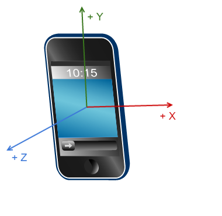

# Core Motion

The Core Motion Framework can be used to access values from the Accelerometer and the Gyroscope sensors. 

**Key Classes**

* *CMMotionManager*
* *CMDeviceMotion*
* *CMAccelerometerData*
* *CMGyroData*

### The Accelerometer Sensor

The Accelerometer Sensor in a device detects and allows measuring values describing the device's 

* acceleration (movement) &
* gravity (pull of gravity)

It senses the amount of inertial force in a given direction and measures its values in *'g'* units. 

**Three axis Accelerometer**

A Three-axis Accelerometer detects and allows measuring values describing the device's 

* acceleration (movement) &
* gravity (pull of gravity)

in 3-D space.

**Sample accelerometer values**

*~1 g*

* In a device held upright in portrait orientation, the accelerometer detects and measures a value of ~ 1*g* of force along the Y axis on Earth.
* In a device held at an angle, the accelerometer detects and measures a value of ~ 1*g* of force on Earth distributed along the axes based on the angle at which the device is oriented.

*>1 g*

* Any sudden movement in the device like shaking, throwing or dropping it could result in the accelerometer measuring values significantly larger than 1 g.

### The Gyroscope Sensor

The Gyroscope Sensor in a device detects and allows measuring values describing the device's rotation around its axes. 
