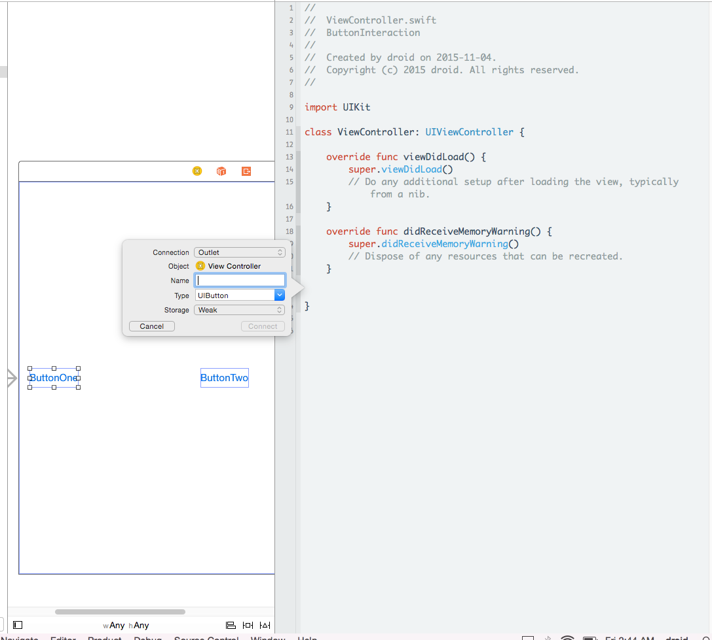
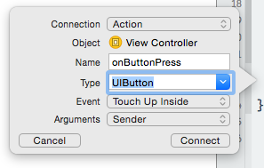

### Creating the Project

### Project Contents

The selected project template creates the following files in the newly created project along with some boilerplate code in the source code files. 


The project contains 
> Two source code files

    AppDelegate.swift
    ViewController.swift

> Storyboard file
  
    Main.storyboard

> Launch Screen file

    LaunchScreen.xib

> Asset Catalog

    Images.xcassets

### Application Delegate

The default code in the following source code file is generated by the project template used to create the project. 

<i>AppDelegate.swift</i>

```swift
import UIKit

@UIApplicationMain
class AppDelegate: UIResponder, UIApplicationDelegate {

	var window: UIWindow?


	func application(application: UIApplication, didFinishLaunchingWithOptions launchOptions: [NSObject: AnyObject]?) -> Bool {
		// Override point for customization after application launch.
		return true
	}

	func applicationWillResignActive(application: UIApplication) {
		// Sent when the application is about to move from active to inactive state. This can occur for certain types of temporary interruptions (such as an incoming phone call or SMS message) or when the user quits the application and it begins the transition to the background state.
		// Use this method to pause ongoing tasks, disable timers, and throttle down OpenGL ES frame rates. Games should use this method to pause the game.
	}

	func applicationDidEnterBackground(application: UIApplication) {
		// Use this method to release shared resources, save user data, invalidate timers, and store enough application state information to restore your application to its current state in case it is terminated later.
		// If your application supports background execution, this method is called instead of applicationWillTerminate: when the user quits.
	}

	func applicationWillEnterForeground(application: UIApplication) {
		// Called as part of the transition from the background to the inactive state; here you can undo many of the changes made on entering the background.
	}

	func applicationDidBecomeActive(application: UIApplication) {
		// Restart any tasks that were paused (or not yet started) while the application was inactive. If the application was previously in the background, optionally refresh the user interface.
	}

	func applicationWillTerminate(application: UIApplication) {
		// Called when the application is about to terminate. Save data if appropriate. See also applicationDidEnterBackground:.
	}


}
```

### View Controller

The default code in the following source code file is generated by the project template used to create the project. 

<i>ViewController.swift</i>

The class "ViewController" is a subclass of <i>UIViewController</i>, which is part of the UIKit framework. It is responsible for managing the application's view. 

```swift
import UIKit

class ViewController: UIViewController {

	override func viewDidLoad() {
		super.viewDidLoad()
		// Do any additional setup after loading the view, typically from a nib.
	}

	override func didReceiveMemoryWarning() {
		super.didReceiveMemoryWarning()
		// Dispose of any resources that can be recreated.
	}


}
```

<b> Refer to objects in the storyboard or nib file from code </b>

A controller class can refer to objects in the storyboard or nib file by declaring a property called <b>outlet</b> and by connecting it to the object that the property should refer to. An outlet property could be considered as a pointer to an UI object in the storyboard or nib file. 

Outlets are ordinary Swift properties that are annotated with <b>@IBOutlet</b>. When the Swift compiler encounters an @IBOutlet property, it just hints Xcode the developer's intention of connecting the property to an object in the UI.

The following example declares an outlet called "simpleButton" that can point to any button in the UI.

```swift
@IBOutlet weak var simpleButton : UIButton!
```

To refer to an object in the storyboard or nib file from a controller class
* declare an <b>outlet</b> property in the controller class of the type that matches with the type of the UI object to point to
* connect the outlet property to the object in the storyboard or nib file

<b> Triggering special methods on UI interaction </b>

UI objects in the storyboard or nib file can be setup to respond to events with event handlers known as <b>action methods</b> or <b>actions</b>, which are defined as special methods in the controller class.

<b>action methods</b> or <b>actions</b> are methods annotated with <b>@IBAction</b>. The annotation specifies the Interface Builder that this method is an event handler that can be triggered by an event of a UI control in a storyboard or nib file. 

To setup a UI control with an action method

METHOD 1:
* define an action method in the controller
* control drag from the UI control to the action method

(or)

METHOD 2:
* control drag from the UI control to the controller class where an action method has to be generated
* a pop-up appears. Complete the settings to generate an action method


Event handlers come in three flavors:

1) Takes no argument

```swift
@IBAction func buttonEventHandler() {
}
```

2) Takes one argument, the "sender" argument which points to the UI object on which the event occurred.
 The "sender" argument allows a single action method to respond to events on multiple controls as it helps to identify what control the event occurred on. 

```swift
@IBAction func buttonEventHandler(sender: UIButton) {
}
```

3) Takes two arguments

```swift
@IBAction func buttonEventHandler(sender: UIButton, forEvent event: UIEvent) {
}
```

### Steps to Follow

<b>Layout the UI</b>

Click on Main.storyboard to open the application's view in Interface Builder of Xcode.   

The square box represents the application's only view. 

Drag and drop buttons from the Object Library to the view, as shown below.


<b>Setup action methods</b>

Select a button and open the assistant editor. Notice the segments in the jump bar.  


Control drag from a button to the controller class where the action method has to be generated


A pop-up is displayed. Fill out the settings and click connect.



Pop-up


<b>Configuring the action method</b>

Set the connnection to Action and type to UIButton



<i>Setting number of arguments the action method accepts</i>


After clicking connect, the following action method is generated


<b> Using the same action method for other buttons</b>


