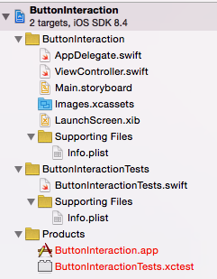

### Project Contents



The project contains 
> Two source code files

    AppDelegate.swift
    ViewController.swift

> Storyboard file
  
    Main.storyboard

> Launch Screen file

    LaunchScreen.xib

> Asset Catalog

    Images.xcassets

### Application Delegate

<i>AppDelegate.swift</i>

```swift
import UIKit

@UIApplicationMain
class AppDelegate: UIResponder, UIApplicationDelegate {

	var window: UIWindow?


	func application(application: UIApplication, didFinishLaunchingWithOptions launchOptions: [NSObject: AnyObject]?) -> Bool {
		// Override point for customization after application launch.
		return true
	}

	func applicationWillResignActive(application: UIApplication) {
		// Sent when the application is about to move from active to inactive state. This can occur for certain types of temporary interruptions (such as an incoming phone call or SMS message) or when the user quits the application and it begins the transition to the background state.
		// Use this method to pause ongoing tasks, disable timers, and throttle down OpenGL ES frame rates. Games should use this method to pause the game.
	}

	func applicationDidEnterBackground(application: UIApplication) {
		// Use this method to release shared resources, save user data, invalidate timers, and store enough application state information to restore your application to its current state in case it is terminated later.
		// If your application supports background execution, this method is called instead of applicationWillTerminate: when the user quits.
	}

	func applicationWillEnterForeground(application: UIApplication) {
		// Called as part of the transition from the background to the inactive state; here you can undo many of the changes made on entering the background.
	}

	func applicationDidBecomeActive(application: UIApplication) {
		// Restart any tasks that were paused (or not yet started) while the application was inactive. If the application was previously in the background, optionally refresh the user interface.
	}

	func applicationWillTerminate(application: UIApplication) {
		// Called when the application is about to terminate. Save data if appropriate. See also applicationDidEnterBackground:.
	}


}
```

### View Controller

<i>ViewController.swift</i>

The class "ViewController" is a subclass of <i>UIViewController</i>, which is part of the UIKit framework. It is responsible for managing the application's view. 

```swift
import UIKit

class ViewController: UIViewController {

	override func viewDidLoad() {
		super.viewDidLoad()
		// Do any additional setup after loading the view, typically from a nib.
	}

	override func didReceiveMemoryWarning() {
		super.didReceiveMemoryWarning()
		// Dispose of any resources that can be recreated.
	}


}
```

<b> Refer to objects in the storyboard or nib file </b>

A controller class can refer to objects in the storyboard or nib file by declaring a property called <b>outlet</b> and by connecting it to the object that the property should refer to. An outlet property could be considered as a pointer to an UI object in the storyboard or nib file. 

Therefore, to refer to an object in the storyboard or nib file from a controller class
* declare an <b>outlet</b> property in the controller class
* connect the outlet property to the object in the storyboard or nib file

<b> Triggering special methods on UI interaction </b>

UI objects in the storyboard or nib file can be setup to respond to events with event handlers known as <b>action methods or actions</b>, which are defined as special methods in the controller class.


